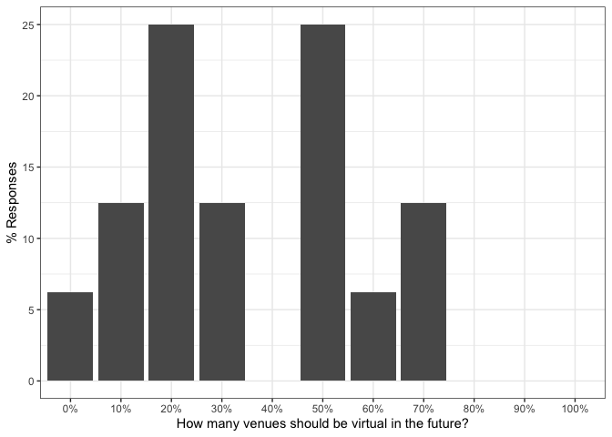
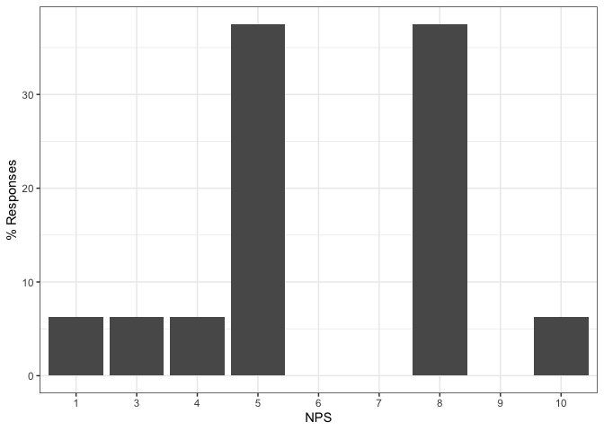

PAM 2020: Responses by users who attended PAM for the first time
================

This document contains results to the PAM 2020 questionnaires.

# Pre-Conf Questionnaire

Number of responses:

    ## [1] 21

## Personal Details

How many PAM conferences have you attended, including this one?
<!-- -->

In which timezone are you?

    preconf$timezone <- recode(preconf$timezone,
           "(GMT -8:00) Pacific Time (US & Canada)" = "-8",
           "(GMT -5:00) Eastern Time (US & Canada), Bogota, Lima" = "-5",
           "(GMT -4:00) Atlantic Time (Canada), Caracas, La Paz" = "-4",
           "(GMT +1:00) Brussels, Copenhagen, Madrid, Paris" = "+1",
           "(GMT +3:00) Baghdad, Riyadh, Moscow, St. Petersburg" = "+3",
           "(GMT +8:00) Beijing, Perth, Singapore, Hong Kong" = "+8"
    )

<!-- -->

From where are you participating in PAM?
<!-- -->

Please rate your professional seniority
<!-- -->

Have you attended a remote conference before?
<!-- -->

Would you have attended PAM as on-site conference in Oregon?
<!-- -->

## Planned participation

Do you intend to use the conference Slack/Zoom as virtual hallway track?
<!-- -->

In which sessions do you plan to participate?
<!-- -->

Do you think you would attend more sessions if you would have attended
PAM as on-site venue?
<!-- -->

## Your goals when attending a on-site conference (e.g., prior editions of PAM)

To begin with, please tell us about your goals when attending an
*on-site conference in person* (such as PAM in the previous years). We
will ask you to your goals when attending PAM as online conference in
the next section.

Importance of presenting my work to this community
<!-- -->

Importance of following paper/poster presentations
<!-- -->

Importance of interacting with other researchers I already know
<!-- -->

Importance of meeting new researchers
<!-- -->

Importance of visiting the city/country in which the conference is held
<!-- -->

## Your goals when attending PAM as virtual conference

Importance of presenting my work to this community
<!-- -->

Importance of following paper/poster presentations
<!-- -->

Importance of interacting with other researchers I already know
<!-- -->

Importance of meeting new researchers
<!-- -->

## Other comments (optional)

Do you have other feedback / wishes / comments that you would like to
share?

``` r
preconf$feedback
```

    ##  [1]                                                                                                                                                                                                                                     
    ##  [2]                                                                                                                                                                                                                                     
    ##  [3]                                                                                                                                                                                                                                     
    ##  [4]                                                                                                                                                                                                                                     
    ##  [5]                                                                                                                                                                                                                                     
    ##  [6] Thank you for the on-line version                                                                                                                                                                                                   
    ##  [7]                                                                                                                                                                                                                                     
    ##  [8]                                                                                                                                                                                                                                     
    ##  [9]                                                                                                                                                                                                                                     
    ## [10] I think in an online format, doing 10-15 min videos + 15 min questions would have allowed for more interaction with the community than the 25 min talk + 5 min questions, given that post-talk corridor talk will be more difficult.
    ## [11]                                                                                                                                                                                                                                     
    ## [12] Thanks for your effort in making this a remote conference!                                                                                                                                                                          
    ## [13]                                                                                                                                                                                                                                     
    ## [14] The time difference makes attending the conference very hard, and limits my participation to the few sessions during which I can stay awake.                                                                                        
    ## [15]                                                                                                                                                                                                                                     
    ## [16] My opinions may change...                                                                                                                                                                                                           
    ## [17]                                                                                                                                                                                                                                     
    ## [18]                                                                                                                                                                                                                                     
    ## [19]                                                                                                                                                                                                                                     
    ## [20]                                                                                                                                                                                                                                     
    ## [21]                                                                                                                                                                                                                                     
    ## 8 Levels:  ... The time difference makes attending the conference very hard, and limits my participation to the few sessions during which I can stay awake.

# Post-Conf Questionnaire

Number of responses:

    ## [1] 16

## Personal details

We first would like to learn few personal details about you to be able
to better interpret your answers in this questionnaire.

Note that these questions are the same as in the pre-conference
questionnaire since we cannot correlate both questionnaires due to
anonymity.

How many PAM conferences have you attended, including this one?
<!-- -->

In which timezone are you?

    postconf$timezone <- recode(postconf$timezone,
           "(GMT -8:00) Pacific Time (US & Canada)" = "-8",
           "(GMT -7:00) Mountain Time (US & Canada)" = "-7",
           "(GMT -5:00) Eastern Time (US & Canada), Bogota, Lima" = "-5",
           "(GMT) Western Europe Time, London, Lisbon, Casablanca" = "+0",
           "(GMT +1:00) Brussels, Copenhagen, Madrid, Paris" = "+1",
           "(GMT +8:00) Beijing, Perth, Singapore, Hong Kong" = "+8"
    )

<!-- -->

From where are you participating in PAM?
<!-- -->

Please rate your professional seniority
<!-- -->

Have you attended a remote conference before?
<!-- -->

Would you have attended PAM as on-site conference in Oregon?
<!-- -->

## Overall Experience

This block is about assessing your overall experience of attending PAM
as virtual conference. Did you enjoy it?

### Overall Experience

My overall experience of attending remotely PAM is
<!-- -->

### Compared to attending on-site, attending remotely allowed me to better focus on the conference

I was more focused on the *technical content*
<!-- -->

I was more focused on *social interactions*
<!-- -->

### My expectations on attending a virtual conference were met

To present my
work

<!-- -->

To follow
presentations

<!-- -->

To interact with
speakers

<!-- -->

To interact with
participants

<!-- -->

### (optional) To speakers: My expectations on attending a virtual conference were met

This is a bug: the question was asked twice (mandatory above),
optionally here.

To present my
work

<!-- -->

### Would you attend more conferences each year if they are offered online

<!-- -->

## Talk Sessions

In this section, we are interested how you experienced the talks
sessions (i.e., paper and poster
presentations).

### What tools did you use to participate in the conference and how well did they work?

<!-- -->

<!-- -->

### How do you rate the presentation sessions of this virtual conference compared to on-site conferences?

Ability to attend
talks

<!-- -->

Ability to focus on the talks without
distractions

<!-- -->

Ability to ask
questions

<!-- -->

Ability to deeply discuss a topic openly with all
participants

<!-- -->

### Did you experience video or audio degradations in Zoom?

<!-- -->

<!-- -->

### Which one of the following factors during the online presentations affected your interest or ability to follow the talk or remain engage

Having a video of the speaker in the corner of
slides

<!-- -->

Presenter’s tone of
speaking

<!-- -->

Changing of the audio across different segments of the
presentation

<!-- -->

### Pros/Cons of pre-recorded talks

<!-- -->

### (optional) Pros: What did you like about pre-recorded talks?

    ##  [1]                                                                                                                                                                    
    ##  [2]                                                                                                                                                                    
    ##  [3] allows presenters to give a polished version of talk without a lot practicing or overtalking                                                                       
    ##  [4] We knew there would be a talk (unlikely to have connectivity problems) and they would start on time (no need to check sound and video working at each transition). 
    ##  [5] One can reduce the number of mistakes during the presentations, and can focus on the main messages.                                                                
    ##  [6]                                                                                                                                                                    
    ##  [7]                                                                                                                                                                    
    ##  [8]                                                                                                                                                                    
    ##  [9] Choice of the presenter: less interactive, i.e., w/o video in a youtube-tutorial style, or highly interactive like a live presentation in front of an audience     
    ## [10]                                                                                                                                                                    
    ## [11] It solves  potential technical problems, but as well allowed speakers to improve their presentation.                                                               
    ## [12]                                                                                                                                                                    
    ## [13] No connection issues.                                                                                                                                              
    ## [14]                                                                                                                                                                    
    ## [15] I like it as a presenter. It allows me to achieve better quality, and do it again if I miss something.                                                             
    ## [16]                                                                                                                                                                    
    ## 15 Levels:  ...

### (optional) Cons: What did you not like about pre-recorded talks?

    ##  [1]                                                                                                                                                                                                                      
    ##  [2]                                                                                                                                                                                                                      
    ##  [3] not much. wouldn't mind if live conferences used pre-recorded talks.                                                                                                                                                 
    ##  [4] Some videos had very little interaction and monotonous voice track, making it very difficult to follow the talk.                                                                                                     
    ##  [5] None                                                                                                                                                                                                                 
    ##  [6]                                                                                                                                                                                                                      
    ##  [7]                                                                                                                                                                                                                      
    ##  [8]                                                                                                                                                                                                                      
    ##  [9] Glued together A/V, i.e., every other slide changing Audio and/or Video conditions                                                                                                                                   
    ## [10]                                                                                                                                                                                                                      
    ## [11]                                                                                                                                                                                                                      
    ## [12]                                                                                                                                                                                                                      
    ## [13] It was my first time to present in front of a webcam. This was harder than expected. The problem with pre-recording is that there's less pressure and it's difficult to make a connection with the audience/ambiance.
    ## [14] Decreased ability to engage with speaker afterwards                                                                                                                                                                  
    ## [15] Audio quality in some presentations was bad. Too much echo or volume too low for example.                                                                                                                            
    ## [16]                                                                                                                                                                                                                      
    ## 14 Levels:  ...

### How many paper sessions did you skip due to time zone differences

<!-- -->

## Presentation-related Interactions

This section is about how you interacted with other participants about
the content presented at the conference in terms of papers and
posters.

### Did you participate in technical discussions on Slack or Zoom?

<!-- -->

### How do you rate the interaction with others during this virtual conference compared to on-site conferences?

Ability to ask
questions

<!-- -->

Moderation of questions by the session chairs when posting to the Zoom
chat

<!-- -->

Ability for detailed technical
discussions

<!-- -->

### With how many participants did you interact in *private* chats?

Slack private
chats

<!-- -->

Zoom private
chats

<!-- -->

### (optional): Pros: Other feedback on *positive* aspects of the ability to interact during this virtual conference

    ##  [1]                                                                                                           
    ##  [2]                                                                                                           
    ##  [3]                                                                                                           
    ##  [4] Interacting during sessions did not interrupt sessions and you could follow the session at the same time. 
    ##  [5]                                                                                                           
    ##  [6]                                                                                                           
    ##  [7]                                                                                                           
    ##  [8]                                                                                                           
    ##  [9]                                                                                                           
    ## [10]                                                                                                           
    ## [11]                                                                                                           
    ## [12]                                                                                                           
    ## [13]                                                                                                           
    ## [14]                                                                                                           
    ## [15]                                                                                                           
    ## [16]                                                                                                           
    ## 8 Levels:  ...

### (optional): Cons: Other feedback on *negative* aspects of the ability to interact during this virtual conference

    ##  [1]                                                                                                                                                                                                                                                                                                                                                                                                                                                                                                                                                                            
    ##  [2]                                                                                                                                                                                                                                                                                                                                                                                                                                                                                                                                                                            
    ##  [3] no natural ability to meet new people                                                                                                                                                                                                                                                                                                                                                                                                                                                                                                                                      
    ##  [4] I only talked with 2 people I didn’t know before. I didn’t find there was any good moment to reach out to people I didn’t know and I wanted to. I had imagined myself talking to someone in the community that I’ve been wanting to meet for some time but did not feel there was a good time to send a private slack message out of the blue. When sessions were over, I didn’t want to stay all the break close to my computer and felt other people wouldn’t either. So I never contacted this person and I know I would have done it during a break in the conference. 
    ##  [5] As a poster presenter, we were given too limited time to receive feedback and have further discussions.                                                                                                                                                                                                                                                                                                                                                                                                                                                                    
    ##  [6]                                                                                                                                                                                                                                                                                                                                                                                                                                                                                                                                                                            
    ##  [7]                                                                                                                                                                                                                                                                                                                                                                                                                                                                                                                                                                            
    ##  [8]                                                                                                                                                                                                                                                                                                                                                                                                                                                                                                                                                                            
    ##  [9] Not all attendees were registered in Slack, so interactions switched to other channels like twitter                                                                                                                                                                                                                                                                                                                                                                                                                                                                        
    ## [10]                                                                                                                                                                                                                                                                                                                                                                                                                                                                                                                                                                            
    ## [11]                                                                                                                                                                                                                                                                                                                                                                                                                                                                                                                                                                            
    ## [12]                                                                                                                                                                                                                                                                                                                                                                                                                                                                                                                                                                            
    ## [13] Questions stay at a higher level. Difficult to meet people and explore collaborations.                                                                                                                                                                                                                                                                                                                                                                                                                                                                                     
    ## [14]                                                                                                                                                                                                                                                                                                                                                                                                                                                                                                                                                                            
    ## [15]                                                                                                                                                                                                                                                                                                                                                                                                                                                                                                                                                                            
    ## [16]                                                                                                                                                                                                                                                                                                                                                                                                                                                                                                                                                                            
    ## 11 Levels:  ...

## Social Interactions (Virtual Hallway Track)

Besides content related to technical presentations (papers / posters),
conferences are about general interactions with known and new
researchers (e.g., during breaks or at the dinner table): the hallway
track. We are interested in this section how you experienced the hallway
track at
PAM.

### Did you use Slack or the Zoom chat to interact with others about topics unrelated to the presentations?

<!-- -->

### How do you rate the quality of social interactions (unrelated to the presentations) during this virtual conference compared to classical on-site conferences?

Interactions with researchers I already
know

<!-- -->

Interactions with new researchers I didn’t know
before

<!-- -->

### (optional) What did you enjoy about social interaction at this virtual conference?

    ##  [1]                                                    
    ##  [2]                                                    
    ##  [3]                                                    
    ##  [4] Nothing. I felt very lonely during the conference. 
    ##  [5]                                                    
    ##  [6]                                                    
    ##  [7]                                                    
    ##  [8]                                                    
    ##  [9]                                                    
    ## [10]                                                    
    ## [11] I hardly interacted.                               
    ## [12]                                                    
    ## [13]                                                    
    ## [14]                                                    
    ## [15]                                                    
    ## [16]                                                    
    ## 8 Levels:  ... not much

### (optional) How can social interactions be improved at virtual conferences?

    ##  [1]                                                                                                                                                                                                                                                                                                                                                                                                                                                                                                                                                                                                                                                  
    ##  [2]                                                                                                                                                                                                                                                                                                                                                                                                                                                                                                                                                                                                                                                  
    ##  [3]                                                                                                                                                                                                                                                                                                                                                                                                                                                                                                                                                                                                                                                  
    ##  [4] This is difficult. I guess a more structured online mixer would have been helpful. For instance something like speed dating between people with similar interest. Using previous questionnaires there could be some match making and a few free slots for each participants wanting to do 3-5min speed dating with the community, be there to meet someone new or to simply have a fixed time to talk with someone you know about what is going on at the conference. Participants can then continue chatting via private slack messages if wanted. But that initial mixer would set the tone for having time for interactions outside sessions. 
    ##  [5]                                                                                                                                                                                                                                                                                                                                                                                                                                                                                                                                                                                                                                                  
    ##  [6]                                                                                                                                                                                                                                                                                                                                                                                                                                                                                                                                                                                                                                                  
    ##  [7]                                                                                                                                                                                                                                                                                                                                                                                                                                                                                                                                                                                                                                                  
    ##  [8]                                                                                                                                                                                                                                                                                                                                                                                                                                                                                                                                                                                                                                                  
    ##  [9]                                                                                                                                                                                                                                                                                                                                                                                                                                                                                                                                                                                                                                                  
    ## [10]                                                                                                                                                                                                                                                                                                                                                                                                                                                                                                                                                                                                                                                  
    ## [11]                                                                                                                                                                                                                                                                                                                                                                                                                                                                                                                                                                                                                                                  
    ## [12]                                                                                                                                                                                                                                                                                                                                                                                                                                                                                                                                                                                                                                                  
    ## [13]                                                                                                                                                                                                                                                                                                                                                                                                                                                                                                                                                                                                                                                  
    ## [14]                                                                                                                                                                                                                                                                                                                                                                                                                                                                                                                                                                                                                                                  
    ## [15]                                                                                                                                                                                                                                                                                                                                                                                                                                                                                                                                                                                                                                                  
    ## [16]                                                                                                                                                                                                                                                                                                                                                                                                                                                                                                                                                                                                                                                  
    ## 7 Levels:  ... i am not seeing any virtualized meetings being successful at this.  and that is bad.

## General comments about remote attendance

### I would like to attend more virtual conferences in the future

<!-- -->

### How many venues should be virtual in the future?

<!-- -->

### Net Promotor Score: How likely is it that you would recommend attending PAM as virtual conference to a colleague?

0 Not at all likely to recommend - 10 Extremely likely to
recommend

<!-- -->

### Pros: What worked well about attending remotely

    ##  [1] Convenient to get to, no travel hassle                                                                                              
    ##  [2] not affected by travel restrictions; save time                                                                                      
    ##  [3] it was easier with family                                                                                                           
    ##  [4] No commuting to the conference and much cheaper to attend. These are two huge advantages.                                           
    ##  [5] Less stress in delivering a talk                                                                                                    
    ##  [6] Q&A                                                                                                                                 
    ##  [7] No travel, affordable possibility to attend                                                                                         
    ##  [8] Great presentation and interaction with presenters.                                                                                 
    ##  [9] Technical Setup, Session following, very structured, good organisation, Pre-recorded Talks were very helpful in limiting disruptions
    ## [10] Great technical support, videos largely well done,                                                                                  
    ## [11] Actual presentations and Q/A.                                                                                                       
    ## [12] Following the presentations                                                                                                         
    ## [13] You can watch videos on-demand. There no travel costs. Better for the environment.                                                  
    ## [14] Convenient                                                                                                                          
    ## [15] Flexibility, expense.                                                                                                               
    ## [16] Talks were well prepared                                                                                                            
    ## 28 Levels: Actual presentations and Q/A. ...

### Cons: What did not work well about attending remotely

    ##  [1] I found it easier to get distracted (which is my issue and not yours), and some of the talks of course ended up during meals because of timezones.                                                                                                       
    ##  [2] time zone difference ; pre-recorded presentation not flexible                                                                                                                                                                                            
    ##  [3] meeting people and forming collaborations                                                                                                                                                                                                                
    ##  [4] Getting a sense of community, getting to know the community better.                                                                                                                                                                                      
    ##  [5] Offline discussion is more difficult somehow                                                                                                                                                                                                             
    ##  [6] Timezone                                                                                                                                                                                                                                                 
    ##  [7] No private/off topic conversations during the breaks, mainly focused on presentations                                                                                                                                                                    
    ##  [8] Time zone difference makes me feel not so great                                                                                                                                                                                                          
    ##  [9] Sometimes I got distracted while working from home, which can be fixed by attending from the office in the future. Social Interactions were very limited.                                                                                                
    ## [10] It will take some iteration before we get used and look for interaction with others                                                                                                                                                                      
    ## [11] No effective social interaction, which I greatly miss.                                                                                                                                                                                                   
    ## [12] Trying not to do my own work                                                                                                                                                                                                                             
    ## [13] Attending sessions was difficult to due time zone differences. However, another issue is that the regular work continues (and seems more important though it perhaps isn't). Being at a venue blocks your agenda and makes your focus on the conference. 
    ## [14] Interaction with other participants                                                                                                                                                                                                                      
    ## [15] Encouragement for new researchers, discovery, socialization                                                                                                                                                                                              
    ## [16] Timezone, my session was on 11 PM local                                                                                                                                                                                                                  
    ## 28 Levels: Attending sessions was difficult to due time zone differences. However, another issue is that the regular work continues (and seems more important though it perhaps isn't). Being at a venue blocks your agenda and makes your focus on the conference.  ...

### Other comments / suggestions / feedback

    ##  [1] While I would have definitely preferred it to be in person, the organizers did a really great job given the circumstances. I can only imagine the machinations that went into moving PAM from in-person to virtual, and I very much appreciate the work that you all did.                                                                                                                                                                        
    ##  [2]                                                                                                                                                                                                                                                                                                                                                                                                                                                  
    ##  [3]                                                                                                                                                                                                                                                                                                                                                                                                                                                  
    ##  [4] From my experience, I see the trade off being: invest more time & resources in attending in person to a conference and getting quite a bit from the in person interaction or not as much time and resources invested in attending online but getting less out of it. So from that trade off I think there could be conference fully online or at least have conference give the option to attend online (real-time streaming + dedicated chats). 
    ##  [5]                                                                                                                                                                                                                                                                                                                                                                                                                                                  
    ##  [6] Future online conferences should have longer Q&A sections and possible multiple "venues" during the same couple of days.                                                                                                                                                                                                                                                                                                                         
    ##  [7]                                                                                                                                                                                                                                                                                                                                                                                                                                                  
    ##  [8]                                                                                                                                                                                                                                                                                                                                                                                                                                                  
    ##  [9] No travel time and costs, no negative climate impact, reduced registration fees - this could lead to more attendees if this format is established. win|win!                                                                                                                                                                                                                                                                                      
    ## [10] Remote participation should be enabled also for physical events                                                                                                                                                                                                                                                                                                                                                                                  
    ## [11]                                                                                                                                                                                                                                                                                                                                                                                                                                                  
    ## [12]                                                                                                                                                                                                                                                                                                                                                                                                                                                  
    ## [13] Thanks for your flexibility in changing the conference to a remote one. I can imagine this was very difficult for you. When this is all over, I hope to shake hands with you and have a drink in person. I planned a holiday to Oregon anyway. ;-)  Cheer, Thymen                                                                                                                                                                                
    ## [14]                                                                                                                                                                                                                                                                                                                                                                                                                                                  
    ## [15]                                                                                                                                                                                                                                                                                                                                                                                                                                                  
    ## [16]                                                                                                                                                                                                                                                                                                                                                                                                                                                  
    ## 14 Levels:  ...
