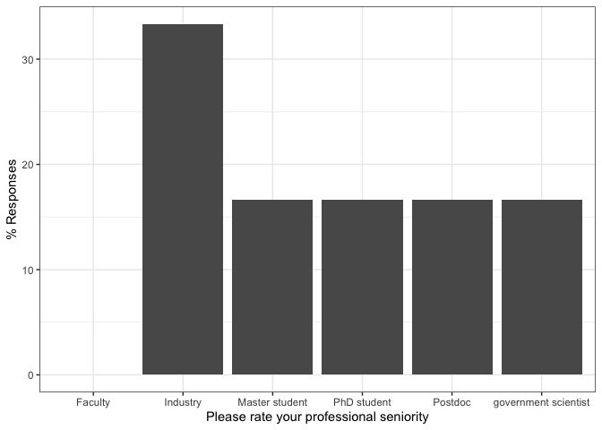
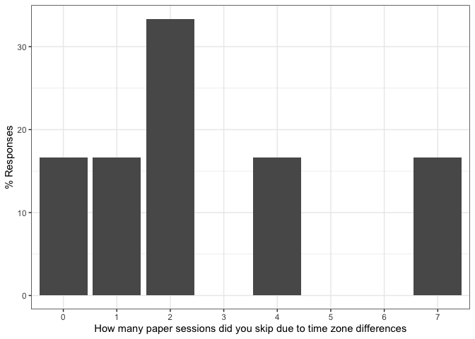
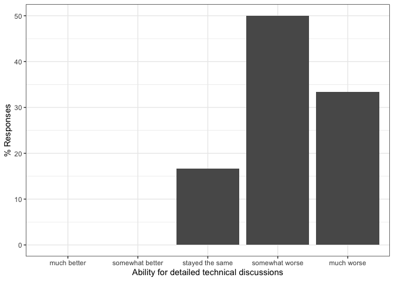

PAM 2020: Responses by users with poor experience
================

This document contains results to the PAM 2020 questionnaires.

# Post-Conf Questionnaire

Number of responses:

    ## [1] 6

## Personal details

We first would like to learn few personal details about you to be able
to better interpret your answers in this questionnaire.

Note that these questions are the same as in the pre-conference
questionnaire since we cannot correlate both questionnaires due to
anonymity.

How many PAM conferences have you attended, including this one?
<!-- -->

In which timezone are you?

    postconf$timezone <- recode(postconf$timezone,
           "(GMT -8:00) Pacific Time (US & Canada)" = "-8",
           "(GMT -7:00) Mountain Time (US & Canada)" = "-7",
           "(GMT -5:00) Eastern Time (US & Canada), Bogota, Lima" = "-5",
           "(GMT) Western Europe Time, London, Lisbon, Casablanca" = "+0",
           "(GMT +1:00) Brussels, Copenhagen, Madrid, Paris" = "+1",
           "(GMT +8:00) Beijing, Perth, Singapore, Hong Kong" = "+8"
    )

<!-- -->

From where are you participating in PAM?
<!-- -->

Please rate your professional seniority
<!-- -->

Have you attended a remote conference before?
<!-- -->

Would you have attended PAM as on-site conference in Oregon?
<!-- -->

## Overall Experience

This block is about assessing your overall experience of attending PAM
as virtual conference. Did you enjoy it?

### Overall Experience

My overall experience of attending remotely PAM is
<!-- -->

### Compared to attending on-site, attending remotely allowed me to better focus on the conference

I was more focused on the *technical content*
<!-- -->

I was more focused on *social interactions*
<!-- -->

### My expectations on attending a virtual conference were met

To present my work

<!-- -->

To follow presentations

<!-- -->

To interact with speakers

<!-- -->

To interact with
participants

<!-- -->

### (optional) To speakers: My expectations on attending a virtual conference were met

This is a bug: the question was asked twice (mandatory above),
optionally here.

To present my
work

<!-- -->

### Would you attend more conferences each year if they are offered online

<!-- -->

## Talk Sessions

In this section, we are interested how you experienced the talks
sessions (i.e., paper and poster
presentations).

### What tools did you use to participate in the conference and how well did they work?

<!-- -->

<!-- -->

### How do you rate the presentation sessions of this virtual conference compared to on-site conferences?

Ability to attend talks

<!-- -->

Ability to focus on the talks without distractions

<!-- -->

Ability to ask questions

<!-- -->

Ability to deeply discuss a topic openly with all
participants

<!-- -->

### Did you experience video or audio degradations in Zoom?

<!-- -->

<!-- -->

### Which one of the following factors during the online presentations affected your interest or ability to follow the talk or remain engage

Having a video of the speaker in the corner of slides

<!-- -->

Presenter’s tone of speaking

<!-- -->

Changing of the audio across different segments of the
    presentation

<!-- -->

### Pros/Cons of pre-recorded talks

<!-- -->

### (optional) Pros: What did you like about pre-recorded talks?

    ## [1] We knew there would be a talk (unlikely to have connectivity problems) and they would start on time (no need to check sound and video working at each transition). 
    ## [2]                                                                                                                                                                    
    ## [3]                                                                                                                                                                    
    ## [4]                                                                                                                                                                    
    ## [5]                                                                                                                                                                    
    ## [6] No connection issues.                                                                                                                                              
    ## 15 Levels:  ...

### (optional) Cons: What did you not like about pre-recorded talks?

    ## [1] Some videos had very little interaction and monotonous voice track, making it very difficult to follow the talk.                                                                                                     
    ## [2] Decreased ability to engage with speaker afterwards                                                                                                                                                                  
    ## [3]                                                                                                                                                                                                                      
    ## [4]                                                                                                                                                                                                                      
    ## [5]                                                                                                                                                                                                                      
    ## [6] It was my first time to present in front of a webcam. This was harder than expected. The problem with pre-recording is that there's less pressure and it's difficult to make a connection with the audience/ambiance.
    ## 14 Levels:  ...

### How many paper sessions did you skip due to time zone differences

<!-- -->

## Presentation-related Interactions

This section is about how you interacted with other participants about
the content presented at the conference in terms of papers and
posters.

### Did you participate in technical discussions on Slack or Zoom?

<!-- -->

### How do you rate the interaction with others during this virtual conference compared to on-site conferences?

Ability to ask questions

<!-- -->

Moderation of questions by the session chairs when posting to the Zoom
chat

<!-- -->

Ability for detailed technical discussions

<!-- -->

### With how many participants did you interact in *private* chats?

Slack private chats

<!-- -->

Zoom private
chats

<!-- -->

### (optional): Pros: Other feedback on *positive* aspects of the ability to interact during this virtual conference

    ## [1] Interacting during sessions did not interrupt sessions and you could follow the session at the same time. 
    ## [2]                                                                                                           
    ## [3]                                                                                                           
    ## [4]                                                                                                           
    ## [5]                                                                                                           
    ## [6]                                                                                                           
    ## 8 Levels:  ...

### (optional): Cons: Other feedback on *negative* aspects of the ability to interact during this virtual conference

    ## [1] I only talked with 2 people I didn’t know before. I didn’t find there was any good moment to reach out to people I didn’t know and I wanted to. I had imagined myself talking to someone in the community that I’ve been wanting to meet for some time but did not feel there was a good time to send a private slack message out of the blue. When sessions were over, I didn’t want to stay all the break close to my computer and felt other people wouldn’t either. So I never contacted this person and I know I would have done it during a break in the conference. 
    ## [2]                                                                                                                                                                                                                                                                                                                                                                                                                                                                                                                                                                            
    ## [3]                                                                                                                                                                                                                                                                                                                                                                                                                                                                                                                                                                            
    ## [4]                                                                                                                                                                                                                                                                                                                                                                                                                                                                                                                                                                            
    ## [5]                                                                                                                                                                                                                                                                                                                                                                                                                                                                                                                                                                            
    ## [6] Questions stay at a higher level. Difficult to meet people and explore collaborations.                                                                                                                                                                                                                                                                                                                                                                                                                                                                                     
    ## 11 Levels:  ...

## Social Interactions (Virtual Hallway Track)

Besides content related to technical presentations (papers / posters),
conferences are about general interactions with known and new
researchers (e.g., during breaks or at the dinner table): the hallway
track. We are interested in this section how you experienced the hallway
track at
PAM.

### Did you use Slack or the Zoom chat to interact with others about topics unrelated to the presentations?

<!-- -->

### How do you rate the quality of social interactions (unrelated to the presentations) during this virtual conference compared to classical on-site conferences?

Interactions with researchers I already know

<!-- -->

Interactions with new researchers I didn’t know
before

<!-- -->

### (optional) What did you enjoy about social interaction at this virtual conference?

    ## [1] Nothing. I felt very lonely during the conference. 
    ## [2]                                                    
    ## [3]                                                    
    ## [4]                                                    
    ## [5]                                                    
    ## [6]                                                    
    ## 8 Levels:  ... not much

### (optional) How can social interactions be improved at virtual conferences?

    ## [1] This is difficult. I guess a more structured online mixer would have been helpful. For instance something like speed dating between people with similar interest. Using previous questionnaires there could be some match making and a few free slots for each participants wanting to do 3-5min speed dating with the community, be there to meet someone new or to simply have a fixed time to talk with someone you know about what is going on at the conference. Participants can then continue chatting via private slack messages if wanted. But that initial mixer would set the tone for having time for interactions outside sessions. 
    ## [2]                                                                                                                                                                                                                                                                                                                                                                                                                                                                                                                                                                                                                                                  
    ## [3]                                                                                                                                                                                                                                                                                                                                                                                                                                                                                                                                                                                                                                                  
    ## [4]                                                                                                                                                                                                                                                                                                                                                                                                                                                                                                                                                                                                                                                  
    ## [5]                                                                                                                                                                                                                                                                                                                                                                                                                                                                                                                                                                                                                                                  
    ## [6]                                                                                                                                                                                                                                                                                                                                                                                                                                                                                                                                                                                                                                                  
    ## 7 Levels:  ... i am not seeing any virtualized meetings being successful at this.  and that is bad.

## General comments about remote attendance

### I would like to attend more virtual conferences in the future

<!-- -->

### How many venues should be virtual in the future?

<!-- -->

### Net Promotor Score: How likely is it that you would recommend attending PAM as virtual conference to a colleague?

0 Not at all likely to recommend - 10 Extremely likely to
    recommend

<!-- -->

### Pros: What worked well about attending remotely

    ## [1] No commuting to the conference and much cheaper to attend. These are two huge advantages. 
    ## [2] Convenient                                                                                
    ## [3] Convenient to get to, no travel hassle                                                    
    ## [4] The presentations                                                                         
    ## [5] Q&A                                                                                       
    ## [6] You can watch videos on-demand. There no travel costs. Better for the environment.        
    ## 28 Levels: Actual presentations and Q/A. ...

### Cons: What did not work well about attending remotely

    ## [1] Getting a sense of community, getting to know the community better.                                                                                                                                                                                      
    ## [2] Interaction with other participants                                                                                                                                                                                                                      
    ## [3] I found it easier to get distracted (which is my issue and not yours), and some of the talks of course ended up during meals because of timezones.                                                                                                       
    ## [4] The social interactions                                                                                                                                                                                                                                  
    ## [5] Timezone                                                                                                                                                                                                                                                 
    ## [6] Attending sessions was difficult to due time zone differences. However, another issue is that the regular work continues (and seems more important though it perhaps isn't). Being at a venue blocks your agenda and makes your focus on the conference. 
    ## 28 Levels: Attending sessions was difficult to due time zone differences. However, another issue is that the regular work continues (and seems more important though it perhaps isn't). Being at a venue blocks your agenda and makes your focus on the conference.  ...

### Other comments / suggestions / feedback

    ## [1] From my experience, I see the trade off being: invest more time & resources in attending in person to a conference and getting quite a bit from the in person interaction or not as much time and resources invested in attending online but getting less out of it. So from that trade off I think there could be conference fully online or at least have conference give the option to attend online (real-time streaming + dedicated chats). 
    ## [2]                                                                                                                                                                                                                                                                                                                                                                                                                                                  
    ## [3] While I would have definitely preferred it to be in person, the organizers did a really great job given the circumstances. I can only imagine the machinations that went into moving PAM from in-person to virtual, and I very much appreciate the work that you all did.                                                                                                                                                                        
    ## [4]                                                                                                                                                                                                                                                                                                                                                                                                                                                  
    ## [5] Future online conferences should have longer Q&A sections and possible multiple "venues" during the same couple of days.                                                                                                                                                                                                                                                                                                                         
    ## [6] Thanks for your flexibility in changing the conference to a remote one. I can imagine this was very difficult for you. When this is all over, I hope to shake hands with you and have a drink in person. I planned a holiday to Oregon anyway. ;-)  Cheer, Thymen                                                                                                                                                                                
    ## 14 Levels:  ...
