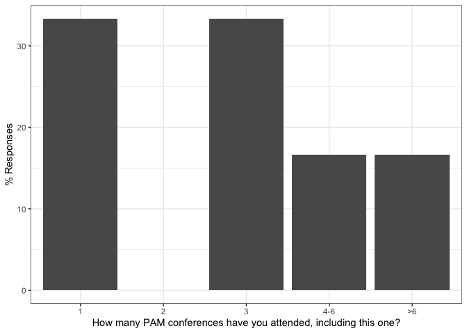
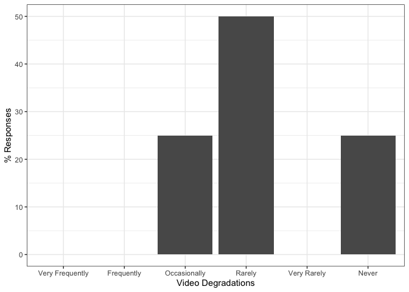
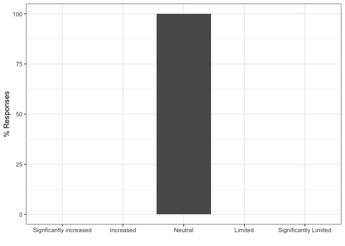

PAM 2020: Responses by users with prior remote conference experience
================

This document contains results to the PAM 2020 questionnaires.

# Pre-Conf Questionnaire

Number of responses:

    ## [1] 6

## Personal Details

How many PAM conferences have you attended, including this one?
<!-- -->

In which timezone are you?

    preconf$timezone <- recode(preconf$timezone,
           "(GMT -8:00) Pacific Time (US & Canada)" = "-8",
           "(GMT -5:00) Eastern Time (US & Canada), Bogota, Lima" = "-5",
           "(GMT -4:00) Atlantic Time (Canada), Caracas, La Paz" = "-4",
           "(GMT +1:00) Brussels, Copenhagen, Madrid, Paris" = "+1",
           "(GMT +3:00) Baghdad, Riyadh, Moscow, St. Petersburg" = "+3",
           "(GMT +8:00) Beijing, Perth, Singapore, Hong Kong" = "+8"
    )

<!-- -->

From where are you participating in PAM?
<!-- -->

Please rate your professional seniority
<!-- -->

Have you attended a remote conference before?
<!-- -->

Would you have attended PAM as on-site conference in Oregon?
<!-- -->

## Planned participation

Do you intend to use the conference Slack/Zoom as virtual hallway track?
<!-- -->

In which sessions do you plan to participate?
<!-- -->

Do you think you would attend more sessions if you would have attended
PAM as on-site venue?
<!-- -->

## Your goals when attending a on-site conference (e.g., prior editions of PAM)

To begin with, please tell us about your goals when attending an
*on-site conference in person* (such as PAM in the previous years). We
will ask you to your goals when attending PAM as online conference in
the next section.

Importance of presenting my work to this community
<!-- -->

Importance of following paper/poster presentations
<!-- -->

Importance of interacting with other researchers I already know
<!-- -->

Importance of meeting new researchers
<!-- -->

Importance of visiting the city/country in which the conference is held
<!-- -->

## Your goals when attending PAM as virtual conference

Importance of presenting my work to this community
<!-- -->

Importance of following paper/poster presentations
<!-- -->

Importance of interacting with other researchers I already know
<!-- -->

Importance of meeting new researchers
<!-- -->

## Other comments (optional)

Do you have other feedback / wishes / comments that you would like to
share?

``` r
preconf$feedback
```

    ## [1]                                                                                                                                             
    ## [2] Good luck - and thanks for all the effort!                                                                                                  
    ## [3]                                                                                                                                             
    ## [4] The time difference makes attending the conference very hard, and limits my participation to the few sessions during which I can stay awake.
    ## [5]                                                                                                                                             
    ## [6]                                                                                                                                             
    ## 8 Levels:  ... The time difference makes attending the conference very hard, and limits my participation to the few sessions during which I can stay awake.

# Post-Conf Questionnaire

Number of responses:

    ## [1] 4

## Personal details

We first would like to learn few personal details about you to be able
to better interpret your answers in this questionnaire.

Note that these questions are the same as in the pre-conference
questionnaire since we cannot correlate both questionnaires due to
anonymity.

How many PAM conferences have you attended, including this one?
<!-- -->

In which timezone are you?

    postconf$timezone <- recode(postconf$timezone,
           "(GMT -8:00) Pacific Time (US & Canada)" = "-8",
           "(GMT -7:00) Mountain Time (US & Canada)" = "-7",
           "(GMT -5:00) Eastern Time (US & Canada), Bogota, Lima" = "-5",
           "(GMT) Western Europe Time, London, Lisbon, Casablanca" = "+0",
           "(GMT +1:00) Brussels, Copenhagen, Madrid, Paris" = "+1",
           "(GMT +8:00) Beijing, Perth, Singapore, Hong Kong" = "+8"
    )

<!-- -->

From where are you participating in PAM?
<!-- -->

Please rate your professional seniority
<!-- -->

Have you attended a remote conference before?
<!-- -->

Would you have attended PAM as on-site conference in Oregon?
<!-- -->

## Overall Experience

This block is about assessing your overall experience of attending PAM
as virtual conference. Did you enjoy it?

### Overall Experience

My overall experience of attending remotely PAM is
<!-- -->

### Compared to attending on-site, attending remotely allowed me to better focus on the conference

I was more focused on the *technical content*
<!-- -->

I was more focused on *social interactions*
<!-- -->

### My expectations on attending a virtual conference were met

To present my
work

<!-- -->

To follow
presentations

<!-- -->

To interact with
speakers

<!-- -->

To interact with
participants

<!-- -->

### (optional) To speakers: My expectations on attending a virtual conference were met

This is a bug: the question was asked twice (mandatory above),
optionally here.

To present my
work

<!-- -->

### Would you attend more conferences each year if they are offered online

<!-- -->

## Talk Sessions

In this section, we are interested how you experienced the talks
sessions (i.e., paper and poster
presentations).

### What tools did you use to participate in the conference and how well did they work?

<!-- -->

<!-- -->

### How do you rate the presentation sessions of this virtual conference compared to on-site conferences?

Ability to attend
talks

<!-- -->

Ability to focus on the talks without
distractions

<!-- -->

Ability to ask
questions

<!-- -->

Ability to deeply discuss a topic openly with all
participants

<!-- -->

### Did you experience video or audio degradations in Zoom?

<!-- -->

<!-- -->

### Which one of the following factors during the online presentations affected your interest or ability to follow the talk or remain engage

Having a video of the speaker in the corner of
slides

<!-- -->

Presenter’s tone of
speaking

<!-- -->

Changing of the audio across different segments of the
presentation

<!-- -->

### Pros/Cons of pre-recorded talks

<!-- -->

### (optional) Pros: What did you like about pre-recorded talks?

    ## [1]                                                                      
    ## [3] helped weak speakers a bit         They were well-prepared and timed.
    ## 15 Levels:  ...

### (optional) Cons: What did you not like about pre-recorded talks?

    ## [1]                                                                        
    ## [3] that one robotic one was horrifying                                    
    ## 14 Levels:  ...

### How many paper sessions did you skip due to time zone differences

<!-- -->

## Presentation-related Interactions

This section is about how you interacted with other participants about
the content presented at the conference in terms of papers and
posters.

### Did you participate in technical discussions on Slack or Zoom?

<!-- -->

### How do you rate the interaction with others during this virtual conference compared to on-site conferences?

Ability to ask
questions

<!-- -->

Moderation of questions by the session chairs when posting to the Zoom
chat

<!-- -->

Ability for detailed technical
discussions

<!-- -->

### With how many participants did you interact in *private* chats?

Slack private
chats

<!-- -->

Zoom private
chats

<!-- -->

### (optional): Pros: Other feedback on *positive* aspects of the ability to interact during this virtual conference

    ## [1]                                                 
    ## [2]                                                 
    ## [3] i am used to zoom and slack, so those were easy 
    ## [4] Didn't have "stage fright" when asking questions
    ## 8 Levels:  ...

### (optional): Cons: Other feedback on *negative* aspects of the ability to interact during this virtual conference

    ## [1]                                                                                                                                                                                   
    ## [2]                                                                                                                                                                                   
    ## [3] the hallway!!!!!  :(                                                                                                                                                              
    ## [4] I didn't have the chance to interact with many participants, maybe private chats were very active but public chats weren't as active as I expected with exceptions on a few papers
    ## 11 Levels:  ...

## Social Interactions (Virtual Hallway Track)

Besides content related to technical presentations (papers / posters),
conferences are about general interactions with known and new
researchers (e.g., during breaks or at the dinner table): the hallway
track. We are interested in this section how you experienced the hallway
track at
PAM.

### Did you use Slack or the Zoom chat to interact with others about topics unrelated to the presentations?

<!-- -->

### How do you rate the quality of social interactions (unrelated to the presentations) during this virtual conference compared to classical on-site conferences?

Interactions with researchers I already
know

<!-- -->

Interactions with new researchers I didn’t know
before

<!-- -->

### (optional) What did you enjoy about social interaction at this virtual conference?

    ## [1]                                                                                                                      
    ## [2] Useless                                                                                                              
    ## [3] not much                                                                                                             
    ## [4] Language is not a barrier because it's easier to understand written language, no problem with understanding accents. 
    ## 8 Levels:  ... not much

### (optional) How can social interactions be improved at virtual conferences?

    ## [1]                                                                                                                                                              
    ## [2]                                                                                                                                                              
    ## [3] i am not seeing any virtualized meetings being successful at this.  and that is bad.                                                                         
    ## [4] More public discussions outside the Q&As after the paper. Maybe arrange discussion sessions where participants join a zoom session just for open discussion. 
    ## 7 Levels:  ... i am not seeing any virtualized meetings being successful at this.  and that is bad.

## General comments about remote attendance

### I would like to attend more virtual conferences in the future

<!-- -->

### How many venues should be virtual in the future?

<!-- -->

### Net Promotor Score: How likely is it that you would recommend attending PAM as virtual conference to a colleague?

0 Not at all likely to recommend - 10 Extremely likely to
recommend

<!-- -->

### Pros: What worked well about attending remotely

    ## [1] Q&A                                                                                                                                                               
    ## [2] Technically everything was fine                                                                                                                                   
    ## [3] that we could do it at all                                                                                                                                        
    ## [4] Avoiding traveling is a big plus for many reasons (family, financial, practical). Ability to focus on presentations and interact with presenters is *much* better.
    ## 28 Levels: Actual presentations and Q/A. ...

### Cons: What did not work well about attending remotely

    ## [1] Timezone                                                                                                       
    ## [2] Just like seeing videos on youtube...                                                                          
    ## [3] the hallway                                                                                                    
    ## [4] I felt I didn't have the chance to interact with enough people and make new connections, maybe it's me though. 
    ## 28 Levels: Attending sessions was difficult to due time zone differences. However, another issue is that the regular work continues (and seems more important though it perhaps isn't). Being at a venue blocks your agenda and makes your focus on the conference.  ...

### Other comments / suggestions / feedback

    ## [1] Future online conferences should have longer Q&A sections and possible multiple "venues" during the same couple of days.                                                                                                                                                                                                                                                                 
    ## [2] Organizers did a super job. It’s just that remote conferences are not ... conferences                                                                                                                                                                                                                                                                                                    
    ## [3] my sympathies to the organizers.  it came off better than i hoped.                                                                                                                                                                                                                                                                                                                       
    ## [4] Use slack for Q&A after presentations because of the ability to follow threads. A open-discussion Zoom session. Talks/slides are published after they are streamed to have the ability to rewind some points. Have a speed-dating session for participants in which each participant should make a 5-min call with a random subset of other participants to re-enforce the social aspect.
    ## 14 Levels:  ...
